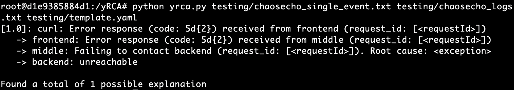

# K8S Log Enabler - Kubernetes Log Collector for Root Cause Analysis in Microservices

Final Thesis project for the Bachelor Degree in Computer Science at the University of Pisa, Italy. October 2023.

## Overview

In a microservices architecture, logs are crucial to understanding the behavior of the system and to debug issues.

Following design principles, a microservice should be failure-tolerant, meaning that it should be able to handle failures gracefully and recover from them.

However, this is not always the case, and a failure in a microservice can trigger a cascade of failures in other microservices, leading to a system-wide outage. Furthermore, if the number of running microservices is large, it can be challenging to identify the root cause of the failure just from the application logs.

This project extends an existing Kubernetes cluster with components that log all the interactions between microservices. The logs are then processed and visualized to help identify the root cause of a failure.

This project is meant to be used with [di-unipi-socc/yRCA](https://github.com/di-unipi-socc/yRCA), a tool that uses the logs collected by this project to identify and explain the root cause of a failure in a microservices architecture.

The report (in Italian) that describes the project can be found at [belgio99/bsc-thesis](https://github.com/belgio99/bsc-thesis).

## Installation

First of all, clone the repository:

```bash
git clone https://github.com/belgio99/k8s-log-enabler
```

Then, install the required dependencies:

```bash
pip install -r requirements.txt
```

You can now run the script with the `main.py` command.

## How it works

An existing Kubernetes cluster is extended with the following components:

- **Istio Proxy**: A sidecar container that runs alongside each pod in the cluster. The Istio Proxy collects logs from the application running in the pod and sends them to Filebeat.
- **Filebeat DaemonSet**: A DaemonSet that runs on each node in the cluster. Filebeat collects interaction logs from Istio Proxy and sends them to Logstash. Application logs are also collected.
- **ELK stack**: Elasticsearch, Logstash, and Kibana. Logs are processed by Logstash and then sent to Elasticsearch. Kibana is not strictly necessary, but it can be used to visualize the log collection process.

The original application is not modified in any way. A copy of the application is deployed in a separate namespace (log-enabled-appname), and the logs are collected from this copy.

The `main.py --inject <app.yaml>` option is used to create the new YAML file containing the application with the log interaction components injected.

### Log generation format

At each interaction between two microservices, Istio Proxy logs the following information (the so-called "access logging"):

```JSON
   {
        "start_time": "%START_TIME%",
        "response_code": "%RESPONSE_CODE%",
        "response_flags": "%RESPONSE_FLAGS%",
        "response_code_details": "%RESPONSE_CODE_DETAILS%",
        "duration": "%DURATION%",
        "request_duration": "%REQUEST_DURATION%",
        "request_tx_duration": "%REQUEST_TX_DURATION%",
        "response_duration": "%RESPONSE_DURATION%",
        "response_tx_duration": "%RESPONSE_TX_DURATION%",
        "authority": "%REQ(:AUTHORITY)%",
        "x-request-id": "%REQ(X-REQUEST-ID)%"
      }
```

This data is then collected by Filebeat, which forwards it to Logstash. Logstash processes the data and sends it to Elasticsearch.

### Log processing

The `main.py --connect` option can be used to connect to an Elasticsearch instance and download the logs. The default format is yRCA-compatible, but GELF and JSON formats are also supported.

- Elasticsearch Scroll API is used to automatically download the logs in batches.

Microservices log can also be exported. All the options can be found in the `main.py --help` command.

Once the yRCA logs are downloaded, they can be processed by yRCA to identify the root cause of a chain failure, like in the following image:



## Side notes

The `main.py` script does not directly interact with the Kubernetes cluster. Instead, it generates the YAML files that can be used to deploy the components in the cluster. This makes it possible to:

- Review the generated YAML files before deploying them
- Deploy the components in a different cluster than the one where the script is run (e.g., AWS EKS, Google GKE, etc.)

Don't forget to star the repository if you find it useful!
